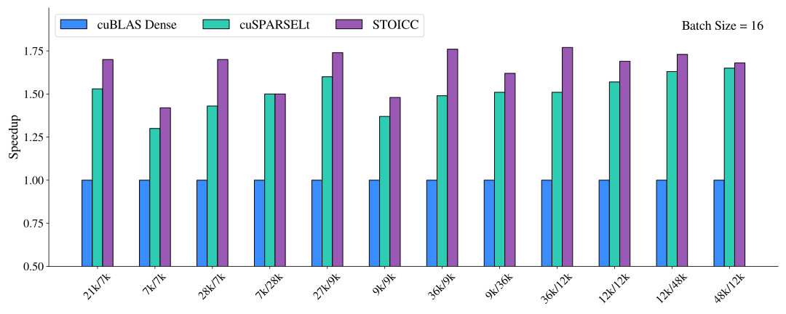
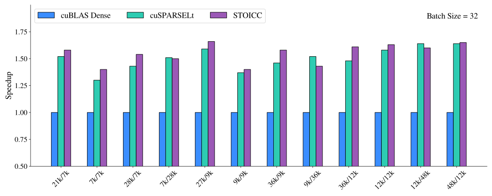
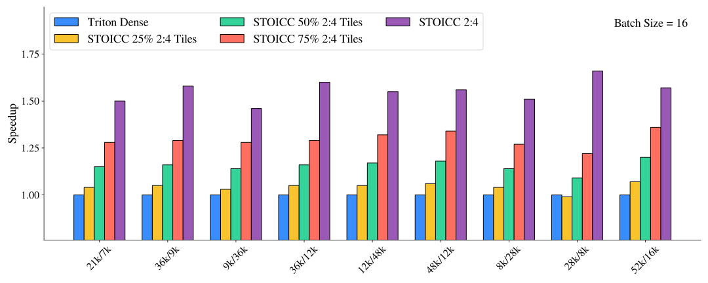
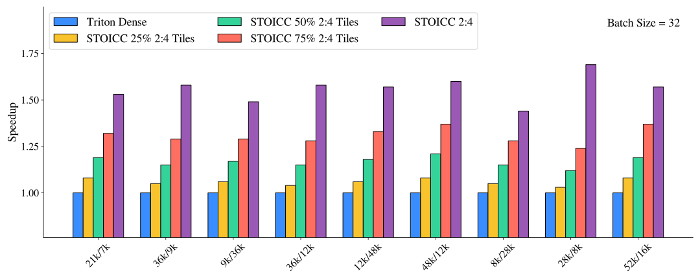

# Sparsity in Triton
This repository contains changes to allow 2:4 and heterogeneous sparsity in Triton.

## 2:4 Sparsity
The goal is to let Triton users leverage 2:4 sparsity with minimal modifications to their dense code. Most kernels written for dense tensors in Triton can be reused with sparse tensors. To enable sparsity, users simply pass inputs wrapped in a `CompressedSparse` object from `triton.sparsity`, which Triton recognizes as sparse.

The creation of a sparse object is decoupled from the pruning and compression code to allow the users to write their own. Example pruning (magnitude) and compression code is available under `python/tutorials/sparse` for users who want to use these features out of the box.

```python
@triton.jit
def matmul_kernel(D, A, B, ...):
  # Normal dense Triton kernel is implemented here
  # There is nothing extra in the code that
  # implies sparsity

# Wrap the Compressed Data and Metadata tensors in a Triton 2:4 tensor type
# There is an example of pruning and compression code implemented in the tutorials directory
A_compressed = CompressedSparse.NV24(A_data, A_metadata)

# Launch the kernel with A_compressed
matmul_kernel[grid](D, A_compressed, B, ...)
```

All operations using the sparse tensor are lowered down using their sparse interpretation. Example 2:4 code can be found in `python/tutorials/sparse/matrix_multiplication_A_sparse.py`.

Performance results below use matrix sizes found in the OPT-175B model with a custom cuSPARSELt 0.6.2.3 integration running on NVIDIA A100 cards. The time measured is only for the matrix multiplication, sparse matrix setup (including pruning and compression) is excluded.





## Tile-level Sparsity
The sparse code generation backend allows us to write a kernel that performs a matmul where A is composed of both 2:4 sparse and dense tiles and B is fully dense. An inspection phase splits the A matrix into tiles, assigns a sparsity format to each and stores them in a tile-level csr-like format. The execution phase (triton kernel) performs the matmul. An example implementation of a simple inspector is provided [here](python/tutorials/sparse/mixed_tile_inspector.py), along with the corresponding [executor and benchmarking code](python/tutorials/sparse/mixed_tile_executor.py).

We benchmark on an NVIDIA A100 (80GB) GPU with a mixture of dense tiles and [2:4](https://developer.nvidia.com/blog/structured-sparsity-in-the-nvidia-ampere-architecture-and-applications-in-search-engines/) sparse tiles, where the 2:4 tiles are selected randomly. For example, "50% 2:4 Tiles" corresponds to a scenario where half of the tiles are pruned to 2:4 sparsity while the other half remain dense, resulting in an overall sparsity level of 25% for the whole matrix. The matrix sizes are chosen based on those used in the OPT family of models.




## Constraints
Currently, our sparsity implementation has three constraints.

1. The metadata must be provided in a specific format to enable 2:4 sparsity optimizations. We provide an example code on how to perform the reordering in `python/tutorials/sparse/compress.py`. The reordering closely resembles [the one used in CUTLASS](https://github.com/NVIDIA/cutlass/blob/main/tools/util/include/cutlass/util/host_reorder.h).
2. `tl.make_block_ptr` and `tl.advance` must be used for pointer manipulation on sparse tensors
3. Only Ampere cards are currently supported with FP16 data types

## Next Steps
Current code modifies the `3.1.x` Triton release, we are working on merging our changes with the Triton main branch and adding Hopper support.

# Install from source

```
git clone https://github.com/triton-lang/triton.git;
cd triton;

pip install ninja cmake wheel; # build-time dependencies
pip install -e python
```

Or with a virtualenv:

```
git clone https://github.com/triton-lang/triton.git;
cd triton;

python -m venv .venv --prompt triton;
source .venv/bin/activate;

pip install ninja cmake wheel; # build-time dependencies
pip install -e python
```

# Building with a custom LLVM

Triton uses LLVM to generate code for GPUs and CPUs.  Normally, the Triton build
downloads a prebuilt LLVM, but you can also build LLVM from source and use that.

LLVM does not have a stable API, so the Triton build will not work at an
arbitrary LLVM version.

1. Find the version of LLVM that Triton builds against.  Check
`cmake/llvm-hash.txt` to see the current version. For example, if it says:
       49af6502c6dcb4a7f7520178bd14df396f78240c

   This means that the version of Triton you have builds against
   [LLVM](https://github.com/llvm/llvm-project) 49af6502.

2. `git checkout` LLVM at this revision.  Optionally, make additional
   modifications to LLVM.

3. [Build LLVM](https://llvm.org/docs/CMake.html).  For example, you might run

       $ cd $HOME/llvm-project  # your clone of LLVM.
       $ mkdir build
       $ cd build
       $ cmake -G Ninja -DCMAKE_BUILD_TYPE=Release -DLLVM_ENABLE_ASSERTIONS=ON ../llvm -DLLVM_ENABLE_PROJECTS="mlir;llvm" -DLLVM_TARGETS_TO_BUILD="host;NVPTX;AMDGPU"
       $ ninja

4. Grab a snack, this will take a while.

5. Build Triton as above, but set the following environment variables.

       # Modify as appropriate to point to your LLVM build.
       $ export LLVM_BUILD_DIR=$HOME/llvm-project/build

       $ cd <triton install>
       $ LLVM_INCLUDE_DIRS=$LLVM_BUILD_DIR/include \
         LLVM_LIBRARY_DIR=$LLVM_BUILD_DIR/lib \
         LLVM_SYSPATH=$LLVM_BUILD_DIR \
         pip install -e python

# Tips for building

- Set `TRITON_BUILD_WITH_CLANG_LLD=true` as an environment variable to use clang
  and lld.  lld in particular results in faster builds.

- Set `TRITON_BUILD_WITH_CCACHE=true` to build with ccache.

- Pass `--no-build-isolation` to `pip install` to make nop builds faster.
  Without this, every invocation of `pip install` uses a different symlink to
  cmake, and this forces ninja to rebuild most of the `.a` files.

- vscode intellisense has some difficulty figuring out how to build Triton's C++
  (probably because, in our build, users don't invoke cmake directly, but
  instead use setup.py).  Teach vscode how to compile Triton as follows.

    - Do a local build.
    - Get the full path to the `compile_commands.json` file produced by the build:
      `find python/build -name 'compile_commands.json | xargs readlink -f'`
    - In vscode, install the
      [C/C++
      extension](https://marketplace.visualstudio.com/items?itemName=ms-vscode.cpptools),
      then open the command palette (`Shift + Command + P` on Mac, or `Shift +
      Ctrl + P` on Windows/Linux) and open `C/C++: Edit Configurations (UI)`.
    - Open "Advanced Settings" and paste the full path to
      `compile_commands.json` into the "Compile Commands" textbox.

# Running tests

There currently isn't a turnkey way to run all the Triton tests, but you can
follow the following recipe.

```shell
# One-time setup.  Note we have to reinstall local Triton because torch
# overwrites it with the public version.
$ pip install scipy numpy torch pytest lit pandas matplotlib && pip install -e python

# Run Python tests using your local GPU.
$ python3 -m pytest python/test/unit

# Move to builddir.  Fill in <...> with the full path, e.g.
# `cmake.linux-x86_64-cpython-3.11`.
$ cd python/build/cmake<...>

# Run C++ unit tests.
$ ninja test

# Run lit tests.
$ lit test
```

You may find it helpful to make a symlink to the builddir and tell your local
git to ignore it.

```
$ ln -s python/build/cmake<...> build
$ echo build >> .git/info/exclude
```

Then you can e.g. rebuild and run lit with the following command.

```
$ ninja -C build && ( cd build ; lit test )
```

# Tips for hacking

For detailed instructions on how to debug Triton's frontend, please refer to this [tutorial](https://triton-lang.org/main/programming-guide/chapter-3/debugging.html). The following includes additional tips for hacking on Triton's backend.

**Helpful environment variables**

- `MLIR_ENABLE_DUMP=1` dumps the IR before every MLIR pass Triton runs.
- `LLVM_IR_ENABLE_DUMP=1` dumps the IR before every pass run over the LLVM IR.
- `TRITON_INTERPRET=1` uses the Triton interpreter instead of running on the
  GPU.  You can insert Python breakpoints in your kernel code!
- `TRITON_ENABLE_LLVM_DEBUG=1` passes `-debug` to LLVM, printing a lot of
  debugging information to stdout.  If this is too noisy, run with just
  `TRITON_LLVM_DEBUG_ONLY` instead to limit the output.

  An alternative way to reduce output noisiness is running with
  `LLVM_IR_ENABLE_DUMP=1`, extract the IR before the LLVM pass of interest, and
  then run LLVM's `opt` standalone, perhaps passing `-debug-only=foo` on the
  command line.
- `TRITON_LLVM_DEBUG_ONLY=<comma-separated>` is the equivalent of LLVM's
  `-debug-only` command-line option. This limits the LLVM debug output to
  specific pass or component names (which are specified using `#define
  DEBUG_TYPE` throughout LLVM and Triton) in order to allow the debug output to
  be less noisy. `TRITON_LLVM_DEBUG_ONLY` allows for one or more comma
  separated values to be specified (eg
  `TRITON_LLVM_DEBUG_ONLY="tritongpu-remove-layout-conversions` or
  `TRITON_LLVM_DEBUG_ONLY="tritongpu-remove-layout-conversions,regalloc"`).
- `USE_TTGIR_LOC=1` reparses the ttgir such that the location information will
  be the line number of the ttgir instead of line number of the python file.
  This can provide a direct mapping from ttgir to llir/ptx. When used with
  performance tools, it can provide a breakdown on ttgir instructions.
- `TRITON_PRINT_AUTOTUNING=1` prints out the best autotuning config and total time
  spent for each kernel after autotuning is complete.
- `DISABLE_LLVM_OPT` will disable llvm optimizations for make_llir and make_ptx
  if its value is true when parsing as Bool. Otherwise, it will be parsed as a list
  of flags to disable llvm optimizations. One usage case is
  `DISABLE_LLVM_OPT="disable-lsr"`
  Loop strength reduction is known to cause up to 10% performance changes for
  certain kernels with register pressure.
- `TRITON_ALWAYS_COMPILE=1` forces to compile kernels regardless of cache hit.
- `MLIR_ENABLE_TIMING` dumps the timing information for each MLIR pass.
- `LLVM_ENABLE_TIMING` dumps the timing information for each LLVM pass.


